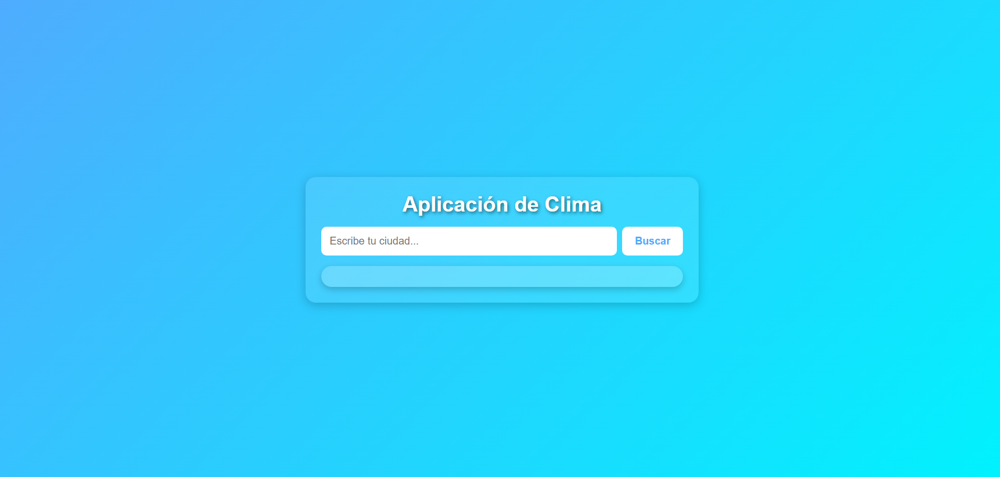
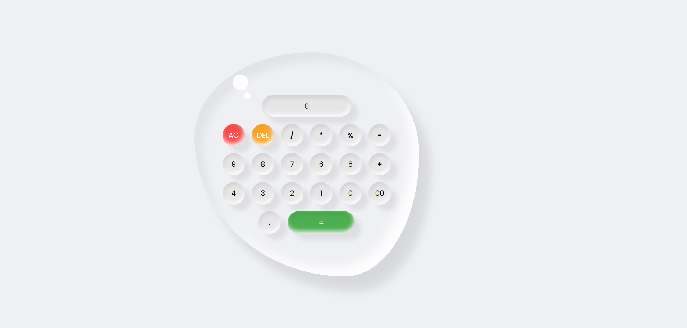
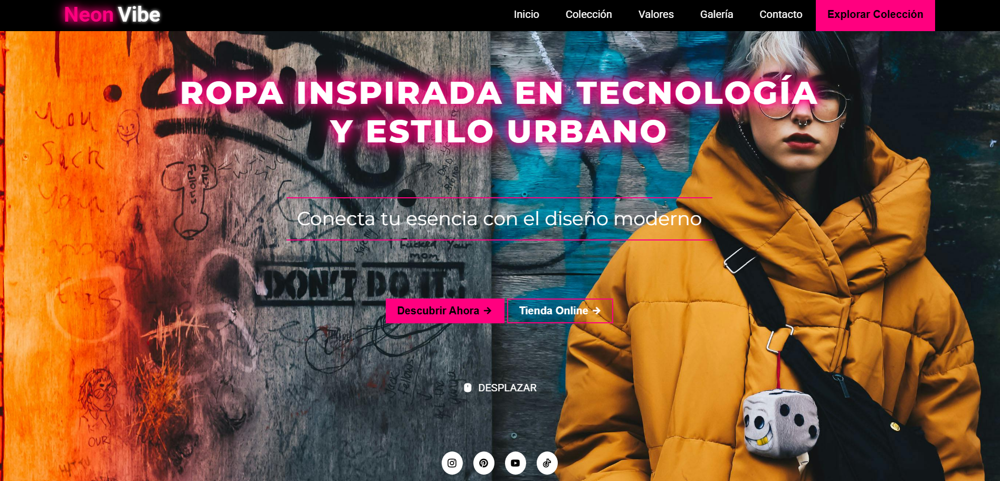

# Rocio Cuello  

**`Desarrolladora Frontend · Desarrollo Web · Software`**

👋 ¡Hola! Soy Rocío Cuello
Soy Desarrolladora Frontend graduada del Instituto Superior Villa del Rosario, en Córdoba, Argentina.
Actualmente, refuerzo mis conocimientos creando proyectos personales y compartiendo contenido de desarrollo web.

📝 Tengo un blog donde comparto recursos, herramientas útiles y todo lo que voy aprendiendo en el mundo del desarrollo web.

✍️ Además, escribo artículos como apuntes o mini cursos, para explicar lo que voy aprendiendo de forma clara y práctica.

### 🔗 Enlaces importantes

 

   
   
    

## 🔗 Conecta conmigo

  
   

---
## Tecnologías

### Frontend

<!---->
<!---->

<!---->

<!---->

 

<!--### Backend-->

<!---->
<!---->
<!---->
<!---->
<!---->

<!-- -->

<!--### Mobile-->

<!---->
<!---->
<!-- -->

<!-- -->

<!--### Database-->

<!--

-->
<!---->

<!-- -->

<!--### Visualización de Datos-->

<!---->

<!-- -->

<!--### Herramientas-->

<!---->
<!---->

<!-- -->

<!--### Services-->

<!---->
<!---->
<!-- -->

<!-- -->

<!--### Tools-->

<!---->

<!-- -->

<!--### Metodologías -->
<!--- [Scrum](https://www.scrum.org/): Enfoque iterativo para la gestión ágil de proyectos y desarrollo de software.  
- [Kanban](https://kanbanize.com/kanban-resources/getting-started/what-is-kanban): Método visual para la gestión del trabajo que optimiza la entrega continua.-->

 

### Others
<!---->

 
 

## GitHub Analytics

  

    

## Proyectos Destacados   
 
🌍 <strong><a href="https://cloudclima.netlify.app/" target="_blank">WeatherApp</a></strong> – App del clima que consume la API de OpenWeather. Incluye manejo de errores y diseño claro.  

🔢 <strong><a href="https://calculadora5.netlify.app/" target="_blank">Calculadora Simple</a></strong> – Aplicación básica que permite realizar operaciones matemáticas simples. Captura los datos ingresados por el usuario y muestra el resultado en pantalla de forma inmediata.

👔 <strong><a href="https://neonvibe.netlify.app/" target="_blank">NeonVibe</a></strong> – Landing page moderna para una marca ficticia de ropa con estilo urbano y vibrante. Destaca productos principales, incluye efectos visuales llamativos y un diseño responsive pensado para captar la atención de potenciales clientes.

## 📄 Artículos
### Artículos Publicados
<ul >
   <li><a href="https://articulohtml.netlify.app/" target="_blank" ><i class="fa-brands fa-html5"></i>HTML</a></li>
   <li><a href="https://articulocss.netlify.app/" target="_blank" ><i class="fa-brands fa-css3-alt"></i>CSS</a></li>
   <li><a href="https://articulobootstrap.netlify.app/" target="_blank" ><i class="fa-brands fa-bootstrap"></i>Bootstrap5</a></li>
   <li><a href="https://articulojavascript.netlify.app/" target="_blank"><i class="fa-brands fa-js"></i>JavaScript</a></li>
   <li><a href="https://articulo-readme.netlify.app/" target="_blank"><i class="fa-brands fa-readme"></i>README.md</a></li>
</ul>

### Próximos Artículos
<ul class="styled-list">
   <li><a href=""><i class="ri-github-fill"></i>Git & GitHub</a></li>
   <li><a href=""><i class="ri-figma-line"></i>Figma</a></li>
   <li><a href=""><i class="fa-solid fa-code"></i>Otros</a></li>
</ul>

## 📢 ¿Querés colaborar?
Si te interesa trabajar en algún proyecto juntos, ¡no dudes en contactarme! Estoy abierta a nuevas oportunidades y colaboraciones.  
📩 Email: <a href="mailto:rociocuello.dev@gmail.com">rociocuello.dev@gmail.com</a>  
🔗 LinkedIn: <a href="https://www.linkedin.com/in/rocio-emilia-cuello-612b19272/" target="_blank">Rocio Cuello</a>                

---

Gracias por tomarte el tiempo de leer mi perfil. ¡No dudes en contactarme si necesitas más información o colaboración!🚀