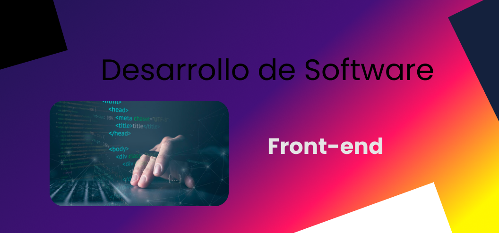

# Rocio Cuello
**`Frontend Developer`**

Hola a todos, soy Rocio Cuello. Me gradué en el Instituto Superior Villa del Rosario, Córdoba.

## Conéctate conmigo:

 

    
    

---

### Frontend
<!-- 
    </a> <a href="https://sass-lang.com" target="_blank" rel="noreferrer">-->
<!-- -->

<!-- -->
 <a href="https://www.chartjs.org" target="_blank" rel="noreferrer"> 
 <!--  </a>-->
 

### Backend
<!-- Tecnologías backend  
  </a>     <a href="https://www.w3schools.com/cs/" target="_blank" rel="noreferrer"> 

 -->
 

### Mobile
<!-- Tecnologías móviles que he visto en clase 

-->
 

### Database
<!-- Bases de datos que he usado -->
  </a> <a href="https://nodejs.org" target="_blank" rel="noreferrer"> 
 

### Services
<!-- Servicios que he usado -->

<!-- -->
 

### Tools
<!-- Herramientas que he usado -->
<!-- -->
 

### Others
<!-- Otras herramientas que he usado -->
  </a> <a href="https://firebase.google.com/" target="_blank" rel="noreferrer"> 
 <!-- Añadir Miro -->
  </a>

### ⚙️ &nbsp;GitHub Analytics

  

